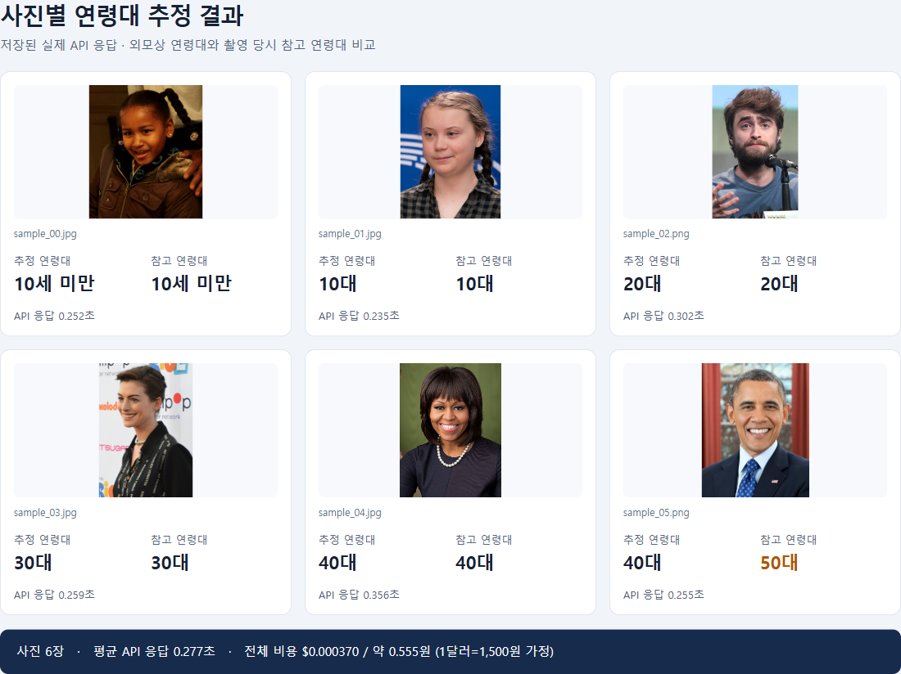
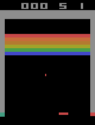

# OpenAI Decisions API 참고자료

이미지를 보고 AI가 판단하는 과정을 살펴보는 노트북 예제입니다. 코드 설명, 응답 시간, 달러·원화 비용을 함께 확인할 수 있습니다.

## 예제

- [사진 연령대 추정](교안_OpenAI_Decisions_사진_연령대_추정.ipynb): 샘플 사진 6장의 외모상 연령대를 추정하고 참고 연령대와 비교합니다.
- [Breakout 자동 플레이](교안_OpenAI_Decisions_Breakout_자동플레이.ipynb): 연속 화면으로 공의 위치·방향을 인식한 뒤 행동을 결정합니다. 10초 분량 플레이와 리플레이를 제공합니다.

## 실행 결과

### 사진 연령대 추정

저장된 실제 API 응답을 사진별로 정리한 화면입니다.



[사진 출처·라이선스](data/age_faces/출처.md)

### Breakout 리플레이

AI가 조작한 실제 10초 플레이입니다.



## 환경 구축

저장소 폴더에서 실행합니다.

```bash
uv sync
```

## 실행

1. `.env.example`을 `.env`로 복사하고 본인의 `OPENAI_API_KEY`를 입력합니다.
2. `uv run jupyter lab`으로 노트북을 열어 위에서 아래로 실행합니다.

[공식 API 문서](https://developers.openai.com/api/docs/guides/decisions)
